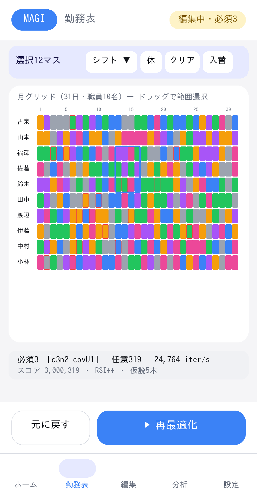
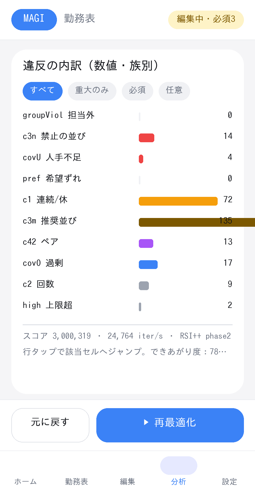

# MAGI 上級者向けレイアウト（プロ編集モード）

**対象ユーザー**: **IT上級者 ＋ 人事課マネージャー ＋ リーダー**。判断もコンピューターも分かり、
**速く・正確に・大量に修正したい**人。
**ねらい**: 一覧性が高く、複数選択・一括編集・直接入力・全制御・数値診断ができる**密度の高い「修正しやすい」**レイアウト。

> [`operator_ux.md`](operator_ux.md)（かんたん＝思考誘導・指1本）とは**別レイアウト**。**設定で切替**、エンジン・データは共通。
> 技術仕様は [`screen_spec.md`](screen_spec.md)。

---

## 0. 2つのレイアウト（同一アプリ・切替式）

| 観点 | かんたん（オペレーター） | **プロ（上級者・本書）** |
|---|---|---|
| 情報密度 | 低（1画面・1目的・1行動） | **高（全体を一覧、月グリッド一望）** |
| 編集 | 1タップで選ぶ | **複数選択・一括・直接入力・コピー/入替** |
| 制約・フラグ | 隠す（折りたたみ） | **全公開・表形式で直接編集** |
| 指標 | 言葉（できあがり度78点） | **数値（HARD/SOFT族別・スコア・iter/s）** |
| 思考誘導 | 強い（次の一手を提示） | **最小（自分で判断する）** |
| 用語 | やさしい言葉 | **正式名（c3n/covU 等）も併記** |

**切替**: 設定 ＞ 表示モード ＝「かんたん」｜「プロ」。即時反映。状態・データ・エンジンは共通（再読込不要）。
個人設定として保存（端末ごと）。既定は「かんたん」。

---

## 1. プロ勤務表エディタ（“修正しやすさ”の核）

### 1.1 高密度グリッド
- **職員×全日（最大31列）を1画面に俯瞰**。セルは小さく（最小40dp高/24–34dp幅）、全体の偏り・穴が面で見える。
- 表示切替: **月グリッド（全日）／7日（大）／スタッフ別**。月は横スクロール許容（明示）。タブレット/横向きで真価。
- 違反セルは**赤ふち＋族の記号**（c3n/covU…）を小さく重畳（プロは記号歓迎）。

### 1.2 複数選択 → 一括編集（上部ツールバー）
- **範囲選択**: セルをドラッグ、または「始点タップ→終点タップ」。選択は青リング。スタッフ名タップ＝行選択、日付タップ＝列選択。
- 選択中、上部に **「選択 N マス」** ＋ アクション:
  - **「このシフトにする ▾」**（プルダウンで 休/日/夜/A4… を選び一括設定。担当外は警告）
  - **「休にする」「クリア」**
  - **「行コピー」**（あるスタッフの並びを別スタッフへ貼付）
  - **「週コピー」**（前週の並びを今週へ）
  - **「2人入替」**（選択2行を同日で交換）
- **直接入力**: 選択範囲がある状態で上部の入力欄に記号を打つ（例 `夜`）→一括反映。連続入力で右/下へ自動送り（Excel風）。

### 1.3 違反の即ドリル
- 違反セルをタップ→ポップオーバーで**正確な規則名＋例＋該当範囲ハイライト**（例:「c3n 入れてはいけない並び：夜勤→早番」）。
- **「この規則を一時的に緩める」**（再最適化時のみ無効化）/「該当を全部見る」。

### 1.4 結果(ws6)／編集中(ws7) 並置・差分
- 上下（または横向きで左右）に **「結果(確定)」と「編集中」**を並べ、**変えたセルをハイライト**。
- 「編集中→結果に反映」「結果→編集中に複製」。**Undo/Redo スタック**＋**編集履歴**（誰がいつ何を変えたか）。

---

## 2. プロ診断パネル（数値で判断）

- **HARD/SOFT を族別の実数**で一覧（`groupViol/c3n/covU/pref` ＝必須、`c1/c2/c3/c3m/c3mn/c41/c42/covO/low/high` ＝任意）。各族に件数＋棒。
- **スコア（weightedScore）・iter/s・フェーズ・各ワーカー最良**を表示。
- フィルタ:「重大のみ」「族で絞る」→**タップで該当セルへジャンプ**。
- 不足枠は **capacity/need の実数**つき（充足不可＝capacity<need／未到達）。
- ※ オペレーター版の「できあがり度」も併記可（共通理解のため）。

---

## 3. プロ実行コントロール

- **方式を明示選択**: AUTO / 高速(V5) / 標準(ALNS) / 推奨(RSI) / 究極(RSI++)。
- 時間予算（秒・**上限600**）、並列数、研磨ON/OFF、シード固定（再現性）。
- **詳細設定（OPT_PARAMS）を直接編集**: reheat/destroy/SmartBailout/LAHC/修復温度/三体重み…＋「既定に戻す」。値は JSON 入出力にも含む（Web互換）。
- **部分再最適化（将来）**: 「固定するセル／自由にするセル」を指定し、選択範囲だけ組み直す。

---

## 4. 制約・年次マスター（フル編集）

- **全制約**(cons1〜cons42)・**個人別回数**(range) を**表形式で直接編集**（追加/削除/複製/並べ替え）。
- **JSON 直接編集ビュー**（上級者向け・スキーマ検証つき・エラー箇所を明示）。
- 取込時の**文字化け自動修復**はプロでも有効（壊れたデータも開ける）。

---

## 5. 指1本・スマホとの両立（プロでも崩さない）

- 高密度でもタップ標的は**最小40dp**確保（プロは小型許容だが下限40）。範囲選択は誤爆防止に「選択モード」トグル。
- 主操作（再最適化・保存・元に戻す）は**下部にも複製**し、片手でも届く。
- 横スクロールは**月グリッドのみ**明示許容。**タブレット・横向き**で最大効率（大画面対応は任意）。
- すべて**Undo/Redo**で安全。破壊操作は確認。

---

## 6. 完成予想（プロ編集モード）

> トークン忠実モック（実装ではない）。再生成 `python3 tools/mock_render_power.py`。

| 画面 | 図 |
|---|---|
| プロ勤務表エディタ（複数選択・一括編集＋診断ストリップ） | `screens/power_01_grid_editor.png` |
| プロ診断パネル（族別の実数・スコア・ジャンプ） | `screens/power_02_diagnostics.png` |

---

## 7. かんたん／プロ の対応（同一エンジン）

| プロ操作 | かんたん操作 | 中身（共通エンジン） |
|---|---|---|
| 一括「このシフトにする」/直接入力 | マスtap→1つ選ぶ | `setCell`（複数化）＋差分再評価 |
| 2人入替/行コピー/週コピー | （なし） | 既存スワップ/コピー操作の束 |
| 方式・OPT_PARAMS 明示 | 「じっくり度」のみ | `handleOptimize` 引数（AUTOを開示） |
| 族別の実数・iter/s | できあがり度・人手不足日 | `UnifiedViolationChecker` の breakdown |
| 規則を一時的に緩める | （なし） | 再最適化時に該当制約を除外（オプション） |

**重要**: 最適化アルゴリズム本体は不変。プロ／かんたんは**同じエンジンの“見せ方と編集力”の違い**だけ（ゴールデンパリティ・差分テストで担保）。

---

## 8. 実装方針（段階）

1. **設定に「表示モード（かんたん/プロ）」トグル**＋保存。プロ時はホーム/勤務表/分析の密度・露出を切替。
2. **プロ診断パネル**（既存 breakdown を族別実数で出すだけ＝低リスク・先行）。
3. **複数選択＋一括「このシフトにする」/クリア**（`setCell` の複数版）。
4. **行/週コピー・2人入替**、違反ドリル、結果/編集中 並置。
5. **詳細設定（OPT_PARAMS）露出**・JSON直接編集。

各項目は「§5 両立条件（最小40dp・下部複製・Undo）」を満たした時点で完了。
